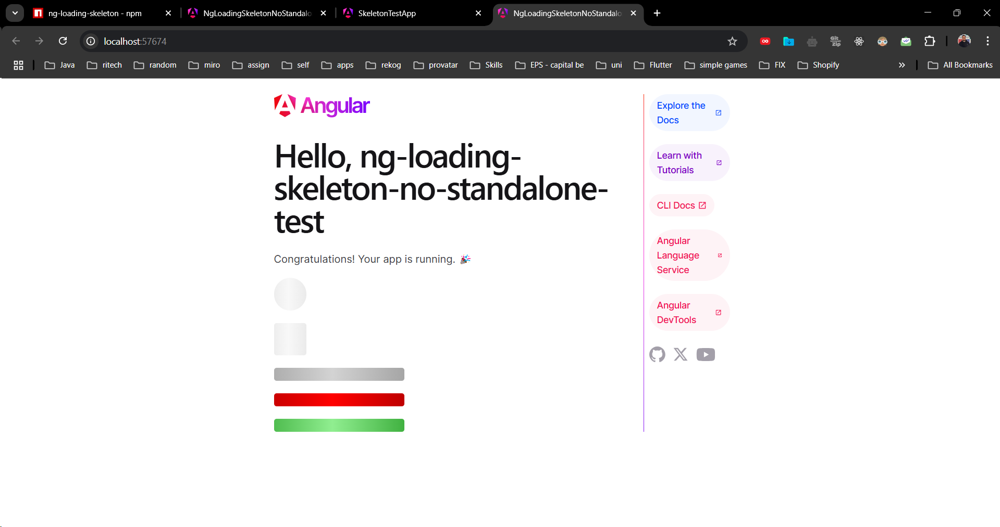

# NgLoadingSkeleton


A lightweight and customizable Angular loading skeleton component. 



Used and tested at: https://github.com/arbrim/ng-loading-skeleton-no-standalone-test

## Installation

Install via npm:
```sh
npm install ng-loading-skeleton
```

## Usage

Import the module:
```typescript
import { NgLoadingSkeletonModule } from 'ng-loading-skeleton';

@NgModule({
  imports: [NgLoadingSkeletonModule]
})
export class AppModule {}
```

Use in templates:
```html
<ng-loading-skeleton width="150px" height="30px" primaryColor="#ccc" secondaryColor="#ddd"></ng-loading-skeleton>
```

## Features
- ✅ Customizable width, height, and border-radius
- 🎨 Customizable **primary and secondary colors**
- 🚀 Lightweight and easy to use
- 🔄 Animated shimmer effect

## Development & Contributions

1. Clone the repo:
   ```sh
   git clone https://github.com/arbrim/ng-loading-skeleton.git
   cd ng-loading-skeleton
   ```
2. Install dependencies:
   ```sh
   npm install
   ```
3. Build the package:
   ```sh
   ng build ng-loading-skeleton
   ```

## Publishing

After building your library with `ng build ng-loading-skeleton`, go to the dist folder `cd dist/ng-loading-skeleton` and run:
```sh
npm publish --access public
```

## Running unit tests

Run `ng test ng-loading-skeleton` to execute the unit tests via [Karma](https://karma-runner.github.io).

## License
This project is licensed under the MIT License - see the [LICENSE](../../LICENSE) file for details.
